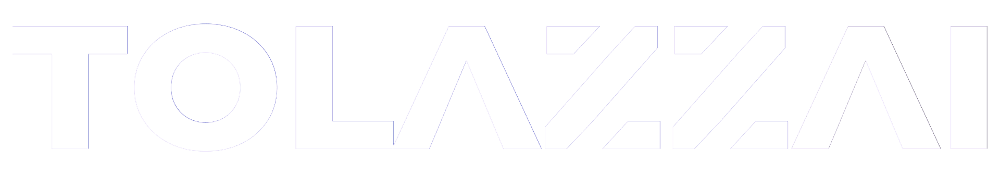

  <!-- Substitua "NOME_DA_SUA_LOGO.png" pelo nome exato do arquivo que você subiu no Passo 1 -->
  
  
    
  
<b>Hiperautomação | Inteligência Artificial | Business Intelligence</b>

   

  <i>"A inovação só é sustentável quando construída sobre uma base de engenharia sólida. Nós não automatizamos apenas tarefas; nós arquitetamos o futuro da sua empresa."</i>

---

## 🚀 Sobre a TolazzAI
A **TolazzAI** é uma empresa de tecnologia focada em elevar o patamar de operações corporativas (B2B). Atuamos na interseção exata entre Inteligência Artificial de ponta, Governança de Dados e Rigor de Engenharia de Qualidade (QA). Construímos ecossistemas onde a tecnologia atende, qualifica e analisa dados 24 horas por dia, blindando o caixa das empresas e multiplicando a escala.

### 🧬 Nosso DNA
- **Zero Achismo:** Decisões pautadas exclusivamente em dados em tempo real (BI).
- **Zero Trabalho Robótico:** O que pode ser automatizado, será automatizado.
- **Governança Absoluta:** Segurança corporativa, conformidade e infraestruturas à prova de falhas.

---

## 🏛️ Nossas Divisões de Operação

### 1. Ecossistema Altonics (Agentes Cognitivos)
Desenvolvemos **Agentes Cognitivos** treinados com a persona, catálogo e regras de negócio da empresa cliente.
- Atendimento e triagem 24/7.
- Integração nativa com ERPs e CRMs (Trello, Jira, PipeDrive, etc).
- *Human Handoff* inteligente com resumo de contexto.

### 2. Business Intelligence & Controladoria
Transformamos o caos de planilhas descentralizadas em "Janelas de Vidro" para a Diretoria (C-Level).
- Dashboards financeiros em tempo real.
- Métricas imobiliárias e executivas avançadas (NOI, Cap Rate, OPEX Ratio, ROI).
- Monitoramento de KPIs operacionais dinâmicos.

### 3. Hiperautomação & Infraestrutura
O motor invisível que elimina o esforço braçal diário das equipes.
- Criação de fluxos de trabalho autônomos de alta complexidade.
- Auditorias de Sistemas, Segurança e Diagnóstico de *Shadow AI*.
- Estruturação de Centros de Excelência em Automação (CoE).

---

## 💻 Nosso Stack Tecnológico & Arsenal

  
  **Inteligência Artificial & LLMs**  
  
  
  
  

    
  **Hiperautomação & Integrações**  
  
  
  

    
  **Engenharia de Dados & BI**  
  
  
  
  
    
  **Front-End & Interfaces Visuais**  
  
  

---

## 🌐 Conecte-se com a TolazzAI

Estamos abertos a discutir projetos corporativos, estruturação de governança tecnológica e parcerias estratégicas.

  
  

 

  

